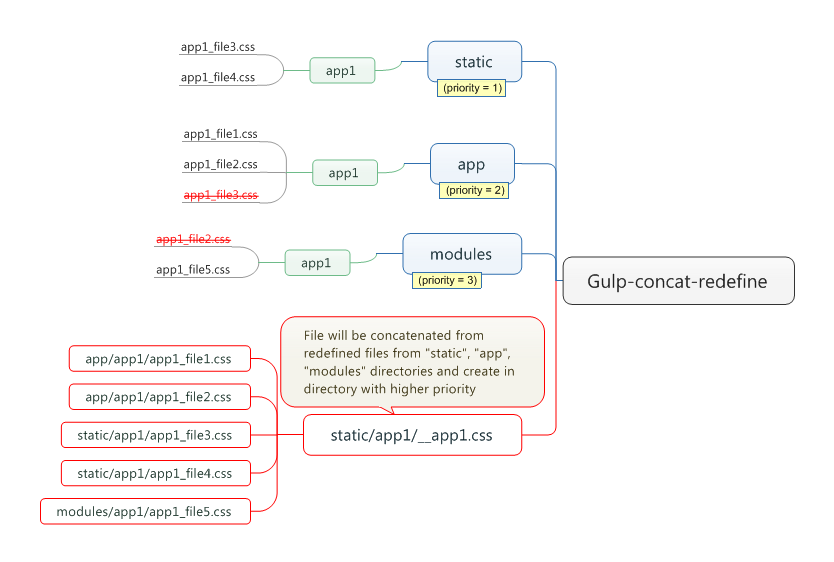

# gulp-concat-redefine

----------

> Finds redefined files and concat in one

A [Gulp](http://gulpjs.com/) plugin for finding redefined application files and concat them in one.

# Getting Started

----------

## Install

```
$ npm install gulp-concat-redefine --save-dev
```

## Example

```
modules/
   ├── bar/
   │   └── css/
   │       ├── bar.css
   │       └── bar-menu.css
   └── baz/
       └── css/
           └── baz.css

project/
    ├── gulpfile.js
    ├── apps/
    │   ├── foo/
    │   │   └── css/
    │   │       ├── foo.css
    │   │       └── foo-title.css
    │   └── baz/
    │       └── css/
    │           └── custom.css
    └── static/
        ├── foo/
        │   └── css/
        │       └── foo-title.css
        └── bar/
            └── css/
                └── bar.css
```

## gulpfile.js

```js
var gulp = require('gulp');
var concat = require('gulp-concat');
var ConcatRedefine = require('gulp-concat-redefine');

var cr = new ConcatRedefine({
    directories: ['./static/', './apps/', '../modules/'],
    type: 'css'
});

gulp.task('css', function() {
    for (var app_name in cr.files) {
        gulp.src(cr.files[app_name])
            .pipe(concat(cr.get_target(app_name)))
            .pipe(gulp.dest(cr.get_dest(app_name)));
    }
});
```
in `cr.files` stored object with files:
```
{
  bar:
   [ './static/bar/css/bar.css',
     '../modules/bar/css/bar-menu.css' ],
  foo:
   [ './static/foo/css/foo-title.css',
     './apps/foo/css/foo.css' ],
  baz:
   [ './apps/baz/css/custom.css',
     '../modules/baz/css/baz.css' ]
}
```
`cr.get_target` return building file name by module name:
```
__bar.css
__foo.css
__baz.css
```
`cr.get_dest` return destination for concatenated file:
```
./static/bar/css/
./static/foo/css/
./apps/baz/css/
```

## How it work

`gulp-concat-redefine` search redefined files from `directories`, then compares it and create one file from redefined files.




#API

----------
##ConcatRedefine(options)
###Options
List of parameters for file collection.

###options.directories
List of directories to search for files.

Type: `Array`

_Required_

> Each directory should contain a list of applications for file search. Redefinition in order of priority directories.

###options.type
Extension of files for collection.

Type: `String`

_Required_


###options.modules_dir
Path to the directory modules added to the project.

Type: `String`

Default: last of `options.directories`


###options.corm
Collect only redefined modules.

Type: `Boolean`

Default: `true`

> if 'false', plugin collects all files from modules directory.


###options.ignore_dirs
Files in the specified directories will be ignored for all applications.

Type: `Array`

Default: ['node_modules', 'bower_components']


###options.ignore_modules

Type: `Array`

Default: []


###options.modules_prefix

Type: `String` or `Array`

Default: []


###options.target_prefix

Type: `String`

Default: '__'


###Properties
* `ConcatRedefine.opts` - The "options" object passed on initialization.
* `ConcatRedefine.files` - Object that stores a list of files for each application.


##ConcatRedefine.get_files()
##ConcatRedefine.get_all_files()
##ConcatRedefine.get_dest(key)
##ConcatRedefine.get_target(key)
##ConcatRedefine.get_all_targets()
##ConcatRedefine.get_watch_patterns()


#Recipes

----------

 - Redefine Django app


```js
var gulp = require('gulp');
var concat = require('gulp-concat');
var ConcatRedefine = require('gulp-concat-redefine');

gulp.task('default', function () {

  var cr = new ConcatRedefine({
      directories: ['./static/', './apps/', '../modules/'],
      type: 'css'
  });

  for (var app_name in cr.files) {
      gulp.src(cr.files[app_name])
          .pipe(concat(cr.get_target(app_name)))
          .pipe(gulp.dest(cr.get_dest(app_name)));
  }
});
```

# License

----------

MIT © [ITCase](http://itcase.pro/)